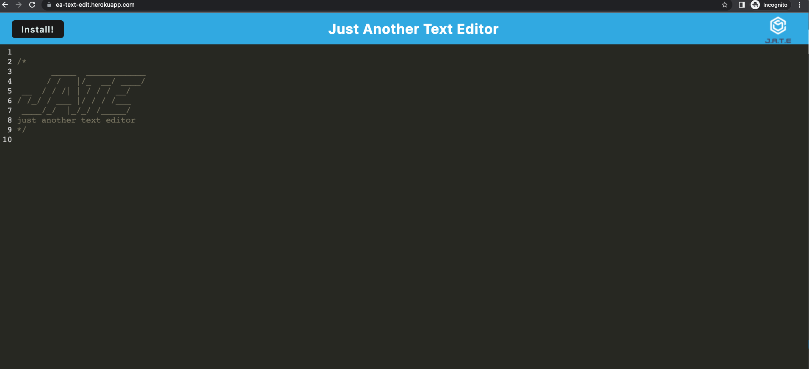

# Text Editor
## Description
This is a text editor that runs in the browser and can also be downloaded to run offline. This app meets PWA criteria.

## Table of Contents
- [Instructions](#instructions)
- [Deployment](#deployment)
- [Tech Used](#tech-used)
- [Mockup](#mockup)
- [License](#license)
- [Questions](#questions)

## Instructions
App is fully functional on Heroku go to the website below

## Deployment
 *Deployment tip*
  open in incognito via chrome
[This App is Live!](https://ea-text-edit.herokuapp.com/)

## Tech Used
Manifest
Service Workers
IndexedDB
Cache
Workbox
Webpack
Express
Deployed on Heroku

## Mockup
Snap of the working application

## License

## Questions?
* [Earl Adams](https://github.com/Bballplayer33)
* earladams2000@gmail.com
        
 If you have any additional question feel free to message or email me.
